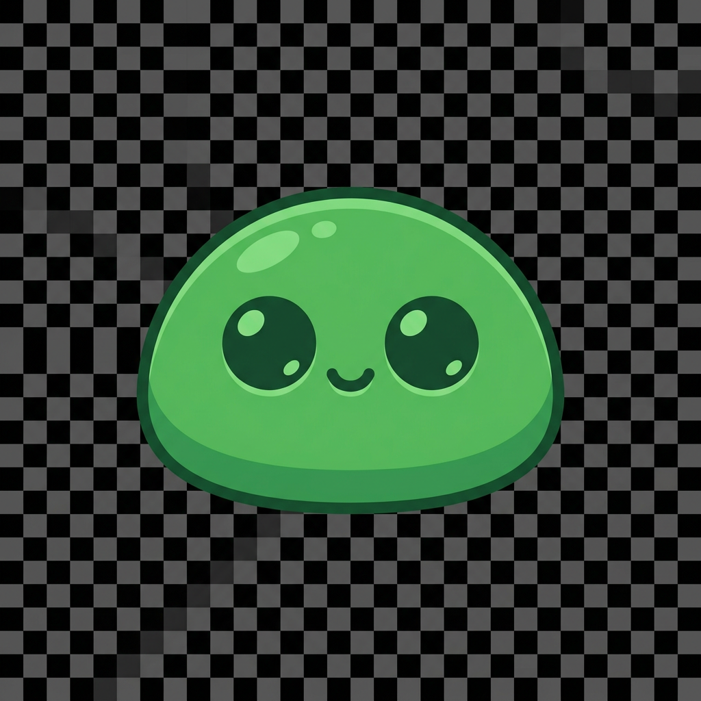

# Cosmetic Pet Mod for Casualties Unknown

Welcome to the **Cosmetic Pet Mod**, a high-end, premium companion experience for *Casualties Unknown* built with native game integration, **ScavLib**, and comprehensive multiplayer synchronization! 

Below is an overview of the features, movement physics, customization options, and advanced multiplayer systems included in this mod.

---

## 🎨 Meet Your Default Companion: Slimy!

Using state-of-the-art visual design, we generated a beautiful, custom **green slime pet** to be your default companion out of the box! 



---

## 🚀 Key Features & Mechanics

### 1. 🦘 High-Fidelity Physics & Follow Behavior
The pet utilizes a sophisticated follow algorithm that mirrors organic companion movement:
- **Horizontal Lag**: Stays at a customizable follow distance behind you, smoothly interpolating horizontal velocity so it trails you gracefully rather than snapping rigidly.
- **Auto-Flipping**: Automatically detects which way you are facing/moving and flips its sprite horizontally so it's always looking in your direction.

### 2. 🌍 Smarter Height Auto-Leveling System
> [!NOTE]
> "be all of the touching the ground unless it would be too low from the expie"

To achieve this exact behavior with maximum visual fidelity and zero jitter, we implemented a sophisticated, high-performance height-leveling algorithm:
- **🌁 Multi-Raycast Sampling (Bridge & Gap Straddling)**: Instead of a single raycast down the middle, the mod casts **three rays** spanning the left, center, and right edges of the pet's scale width. It samples the highest point among them to seamlessly "bridge" 1-tile gaps, grates, and steps without dipping.
- **🪵 Dynamic Platform Matching**: The pet matches the player's ground level by ignoring pass-through (one-way) platforms entirely unless the player is standing on or very close to them (within 0.5 units), ensuring the pet stays alongside you rather than falling through or snapping to unwanted high ledges.
- **🛹 SmoothDamp Suspension (Spring-Damper Interpolation)**: We replace standard linear interpolation with Unity's `Mathf.SmoothDamp`. This acts like a premium sports suspension spring, absorbing sudden step bumps, terrain slopes, and steps with organic acceleration/deceleration.
- **🧗 Airborne Coyote Hover with Gentle Sine-Wave Floating**: When the player jumps, falls, or leaps over deep cliffs, the pet detects that the ground depth exceeds `MaxGroundDistance`. It smoothly locks into an airborne hover state next to your hip level and begins a slow, smooth vertical sine-wave bobbing motion to stay alive and active.
- **🪟 Smart Ceiling Squeezing with Smooth Jelly Transitions**: The pet casts an upward raycast to detect low-clearance tunnels. If a ceiling is too close, the visual squish factor (flattening on Y, expanding on X to preserve volume) is **smoothly interpolated** over time (Lerp), resulting in a realistic, premium "jello-like" squeezing animation that avoids sudden popping or jittering.

### 3. 💃 Walking Wiggle & Squash-and-Stretch
When you are stationary, the pet rests quietly. As soon as you start walking, the pet comes to life:
- **Tilt Wiggle**: Alternates rotating left and right (`Mathf.Sin` driven rotation) to mimic a happy walking gait.
- **Squash & Stretch**: Dynamically scales along the X and Y axes, compressing vertically as it hits the "stride" and stretching as it rises.

### 4. 🛡️ 100% Invincibility
Because this is a **pure cosmetic companion**, the pet does not possess solid physical colliders or health stats, making it completely **invincible** and safe from any game physics glitching, player collisions, or enemy attacks.

---

## 🌐 State-of-the-Art Multiplayer Synchronization

We have implemented an industry-grade P2P and Steam Lobby synchronization architecture so everyone in your multiplayer lobby can admire your custom pets with perfect synchronization!

### 1. 👥 Personalized Follow Dynamics
Movement and positioning parameters are client-authoritative and synchronized per-player:
- **Isolated Settings**: Parameters like `Follow Speed`, `Follow Distance`, and `Max Ground Snapping Distance` are fully unique to each client. When you modify your follow distance, your pet adjusts on everyone's screen, while other players' pets maintain their owners' chosen movement properties.
- **Lobby Member Metadata**: All properties are serialized and updated in real-time inside the Steam lobby metadata (e.g. `cosmetic_pet_follow_speed`, `cosmetic_pet_follow_distance`), where they are parsed and applied individually on remote clients.

### 2. 🚀 Peer-to-Peer Custom PNG Transfer
If you select a custom pet skin that other players don't have installed on their computers, they will still see your pet!
- **On-Demand Requests**: When a remote client joins and detects a new custom pet hash, they automatically issue a reliable P2P Steam Networking request directly to the pet owner.
- **Reliable Binary Stream**: The owner reads their local image file, encodes it as a byte stream, and sends it directly over a dedicated P2P Steam channel (`Channel 1337`).
- **Cached Locally**: The receiving client caches the PNG in their local `Cache/` directory (keyed by the image's SHA1 hash) and loads it dynamically, ensuring zero file conflicts and blazing-fast loading speeds on subsequent sessions.

### 3. 🤫 Motion Noise Filtering (Anti-Jitter)
Multiplayer network sync and floating point precision often cause minor position fluctuations (jitter) when remote players stand still. This could cause pets to rapidly toggle walking wiggles and flip directions back and forth.
- **Position Deadzoning**: We apply a `0.02f` unit/frame position-delta deadzone. If the owner's movement is below this threshold, the pet ignores it and remains resting.
- **Facing Deadzoning**: We increased the mirroring direction flip deadzone to `0.05f` units to ensure the pet stays looking in one direction when stationary.
- **Low-Pass Velocity Filter**: The movement speed is smoothed via a `Mathf.Lerp` filter over time, ensuring walking animations start and stop gracefully with zero twitching, squishing, or instant popping.

---

## 🛠️ Settings & Customization Menu

The mod is fully integrated into both the native game settings menu (**ScavSetLib** / **CU_ModSettings**) and provides a rich, standalone **ImguiWindow**!

- **Toggle Settings Window Key**: **`O`** (opens the in-game UI menu shown below)
- **Toggle Pet Visibility Key**: **`P`** (instantly displays or hides your pet companion)

### Standalone Settings Panel (Toggle: `O`)

```
   +----------------------------------------------+
   |         Cosmetic Pet Mod Settings        [X] |
   +----------------------------------------------+
   | Menu: O   |   Toggle Pet: P                  |
   |                                              |
   | [X] Enable Cosmetic Pet                      |
   |                                              |
   | -- Pet Customization ----------------------- |
   | Pet Scale: 1.00x                             |
   | [=============================]              |
   | Follow Speed: 3.0                            |
   | [=============================]              |
   | Follow Distance: 1.20 units                  |
   | [==========]                                 |
   | Wiggle Speed: 8.0                            |
   | [====================]                       |
   | Wiggle Intensity: 15.0°                      |
   | [====================]                       |
   | Hover Bobbing Amplitude: 0.15 units          |
   | [======]                                     |
   | Hover Bobbing Speed: 3.5                     |
   | [============]                               |
   | Ground Height Offset: 0.40 units             |
   | [========]                                   |
   | Squish Smoothing Speed: 6.0                  |
   | [===============]                            |
   |                                              |
   | -- Import / Select Pet Image --------------- |
   | Pets Folder: BepInEx/plugins/CosmeticPet...  |
   |                                              |
   | Select from installed pets:                  |
   | +------------------------------------------+ |
   | | [X] default_slime.png                    | |
   | | [ ] flying_ghost.png                     | |
   | +------------------------------------------+ |
   |                                              |
   | Import custom image by absolute path or URL: |
   | [ C:\Users\PC\Pictures\cute_dog.png        ] |
   | [           Import Image File / URL        ] |
   +----------------------------------------------+
```

### 📥 Importing Custom Sprites & Dynamic Hot-Reloading

You can import any custom PNG image or URL on-the-fly, and the mod will **hot-reload** your companion **instantly mid-session without restarting the game**!

#### Method A: Direct File Drag-and-Drop
Simply paste any `.png` files into your pet library folder:
`BepInEx/plugins/CosmeticPetMod/Pets/`
They will automatically appear in your in-game settings list where you can click to select and apply them instantly!

#### Method B: In-Game Absolute Path / URL Importer
1. Open the menu in-game using **`O`**.
2. Paste the full file path (e.g. `C:\Users\PC\Pictures\cute_dog.png`) or a direct image URL (e.g. `https://example.com/pet.png`) into the text field.
3. Click **"Import Image File / URL"**. The mod downloads/copies the image, caches it, and applies it to your companion in real-time!

---

## 🗂️ Project File Structure

Here is how the mod has been organized and compiled:

- **[CosmeticPetMod.csproj](CosmeticPetMod.csproj)**: Target Framework `.NET 4.8` utilizing Unity Engine, Steamworks.NET, and ScavLib references.
- **[Plugin.cs](Plugin.cs)**: Main BepInEx entrypoint registering the mod to ScavLib ModRegistry and applying Harmony compatibility patches for native mod settings layout rendering.
- **[ModConfig.cs](ModConfig.cs)**: Standard BepInEx persistent configurations (keys, speeds, offset parameters).
- **[PetController.cs](PetController.cs)**: Governs local follow vectors, raycasting ground collision, keybindings, and wiggling animations.
- **[MpPetManager.cs](MpPetManager.cs)**: Powers Steamworks P2P custom sprite binary streams, lobby metadata sync, independent player follow mechanics, and anti-jitter motion filtering.
- **[CosmeticPetWindow.cs](CosmeticPetWindow.cs)**: Integrates the premium IMGUI interface with sliders, scrollable files list, and path-importing fields.
